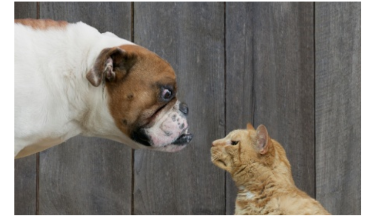
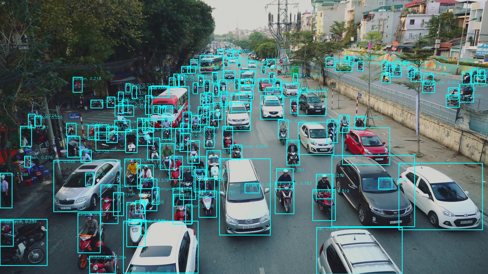
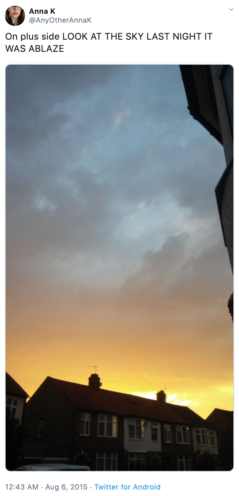

# GPNU_EUD
<h1 align="center">数据科学学习小组</h1>

    <h2 align="center">Eat Up Data</h2>

 @林凯墅

 

## 简介

 

&nbsp;&nbsp;&nbsp;&nbsp;我们小组专注于零基础学习数据科学知识，主张以赛促学、项目促学，建立一个知识共享、互助成长的学习平台

 

## 涉及内容

- python的基础操作

- 机器学习理论与实践

- 深度学习理论与实践

- 参加数据挖掘赛事、项目，以赛促学、项目促学

## 三、 相关数据挖掘赛事

### 1. 结构化数据挖掘

- **[泰坦尼克号的沉没](https://www.kaggle.com/c/titanic)**:

    使用乘客数据（即姓名，年龄，性别，经济舱等）
    
    建立一个预测模型来解决以下问题：“什么样的人更有可能生存？” 

  
 

- **[房屋价格的预测](https://www.kaggle.com/c/house-prices-advanced-regression-techniques/overview/tutorials)**:

    使用房屋的数据（即房屋信息，街区信息等）
    
    建立一个预测模型来解决以下问题：“预测房屋的销售价格”
    

### 2. 计算机视觉

- **[猫狗分类问题](https://www.kaggle.com/c/dogs-vs-cats)**

    编写一种算法来对图像包含狗还是猫进行分类
    
    
 

  

- **目标检测**

  
- **语义分割**

### 3. 自然语言处理
- **[推文态度分类（文本分类）](https://www.kaggle.com/c/nlp-getting-started/overview)**

    根据Twitter发布的内容建立一个模型，判断哪些是真实灾难的，哪些不是

- 问答
- 文本抽取
